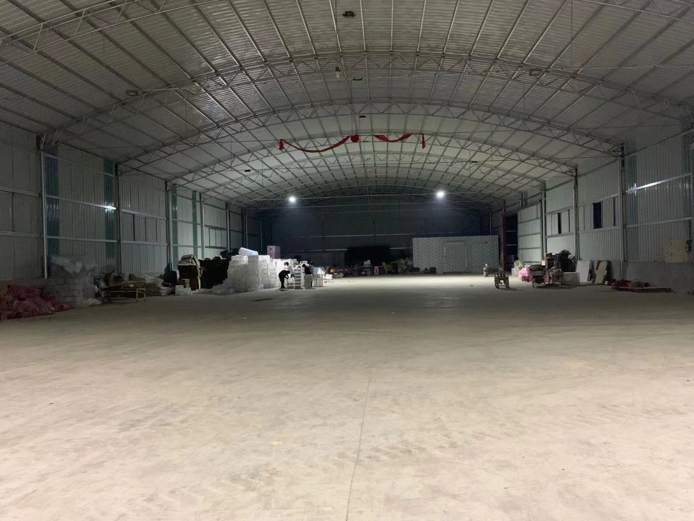
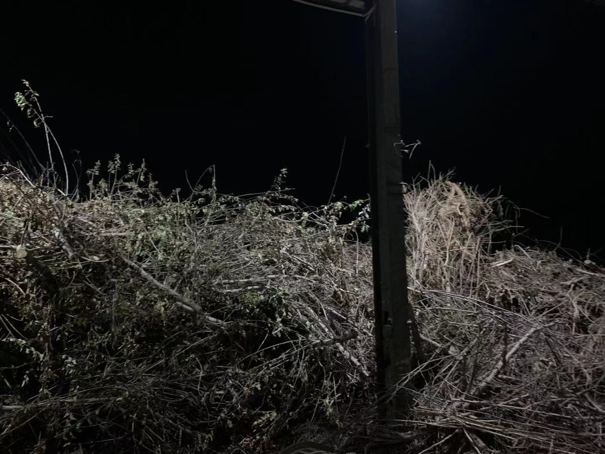
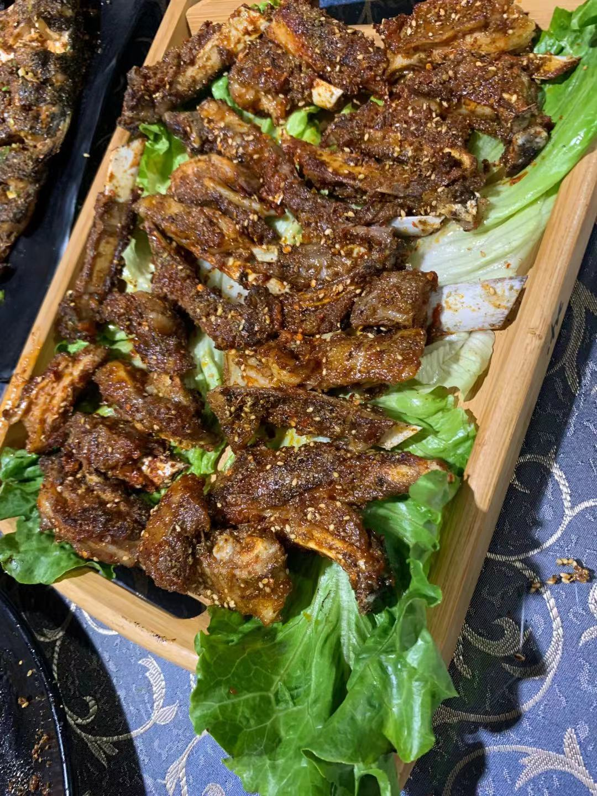
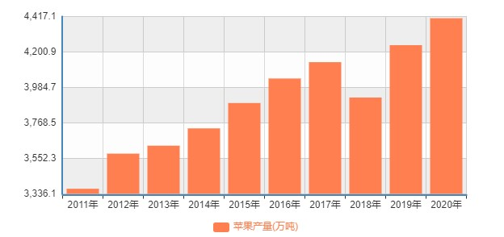
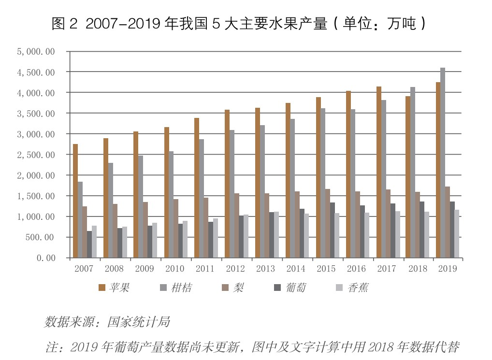
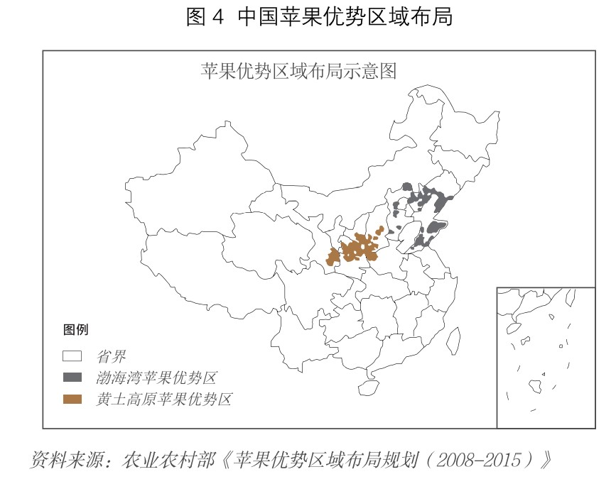
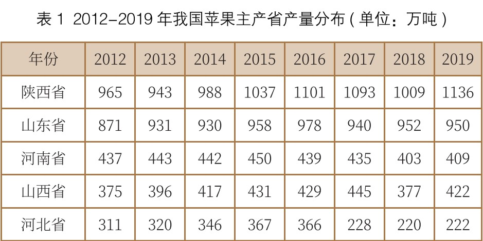

# 苹果调研记录

[toc]

## 价格发现

2021年4月22号在浏览农产品期货的过程中看到苹果的价格非常低，就问了问超群。

4月25号超群发消息说：最近陕西那边的天气不好，所以影响了苹果价格。由此准备问问同学毕超。

5月31号看到一篇新闻：卖1斤亏1元！苹果价格大跌滞销！于是晚上跟毕超打电话交流，交流过后听到了苹果果农已经亏损了几年，毕超收木材的朋友收到了很多砍掉的苹果树木材。

于是记录了以下问题要研究：
1.	内销出口比
2.	减产情况
3.	库存情况
4.	消费端价格
5.	苹果树木材

后来决定国庆期间去调研一番。

## 调研过程

计划好了10月2号和超群汇合一起去临猗。1号跟毕超联系了以后，说永济北离他家更近一些，上12306一看，2号的直达票竟然都已经卖光了，
疫情还是阻挡不住人们出行的步伐。就买了从太原到运城的D2581转G605，超群提前回了老家，他从侯马站上车跟我同坐一辆车。下午4点38
到达永济北，出站后按照毕超说的一直往前走，在一个不熟悉的地方走路总感觉即使不远的路似乎也很长，心想还要走多久才能碰到毕超的时候，
就看到了他在不远处穿着卡其色衬衣向我挥手。毕超开着一辆黑色的大众载着我们开始往他家七级镇出发。

一路上看到了很多苹果地，这大概是第一次看到苹果地。平常很少在农村待，也就对玉米地印象深刻一些。爷爷去世的时候，去过自家的地里，
大伯一个人在打理，当时地里种的就是玉米，总是需要手把玉米拨开往前走，所以对玉米地就留下了一些印象，其他的自己也没留意过，在脑海
中就没有任何印象。

看到来往的半挂车，毕超说这些车里装的都是苹果，让我想起了在交口一路上遇到的装满煤的大车。和装煤的大车不一样，看起来干净许多，就是
会有一些苹果酸臭的味道。毕超说这是落果的味道，在路过一个落果堆的时候，还踩了一脚刹车放慢车速给我们指了一下这里堆放的都是落果，大
卡车从下面把落果装上拉走，你们平常喝的果汁……还没有讲解完后面的车就打着喇叭催促我们快走！毕超提速离开，落果酸臭的气味也逐渐远去。

路过七级中学的时候，毕超说这里是镇上唯一的一个学校，学校里只有几百人，镇上的年轻人都走了，要么在外面打工要么做生意，没有人愿意留
在农村里，现在种地都是靠年纪大的人，甚至农收的时候连帮工都不好找，心中不由感慨“三农问题”的严峻程度。从学校拐过弯200米就到了他家。
毕超父母在七级镇经营着一家小超市，叫小四生活超市，从超市后面走过去就是他家。在家中坐了许久之后，便开始了调研……

### 做苹果电商朋友A

从他家出来坐上车，我以为还有一段距离，结果没开几百米就到了。迎面有一个大仓库，仓库里还是比较空的。A正在仓库外面干着活，处理收到的
高粱。看到我们就摘了手套摆弄着头发，他的头发很个性，就像他看起来有点新疆血统一样，笑起来就更像了。跟A聊完发现他的很多观点跟之前毕
超其他朋友表达的观点有些相悖，比如他认为苹果没有减产，但是其他朋友却说：今年谁还种苹果？

### 做肥料生意的朋友B

离开A那里去下一家，我依旧认为会有一段距离，结果还是一样，大家离得非常近。毕超说B初中也是实验的，23班。等看到B的时候，我印象里没有这个人，他看起来不是很开心的样子，也许是因为化肥生意不好做。刚好在来之前，我大致看了一家化肥企业—新洋丰，便从这里开始聊了起来。

“我刚进来的时候看见你墙上贴着瓮福集团，你是代理的瓮福吗？有没有做新洋丰的化肥？”

“没有，我就做的瓮福的，洋丰的不做。”后来才知道，他在镇下面还有一个店，对面的店就是做新洋丰代理的，他可能不是很喜欢这个牌子或者对面的店老板。

想起来最近农产品价格上涨，农民种植积极性提高，应该对化肥的需求也上涨不少，我就问他今年化肥应该卖的不错吧？但是在他看来，化肥的价格上涨主要还是原料的上涨，就算是价格涨了，我们做代理的也赚不到钱。

我说那你们不能提价吗？他说不行，我们这个价格很透明。离这里差不多有20里地还有一家卖肥料的，一袋尿素比如那家卖122，我这里卖120，农民就会跑这么远，来我这里买，当然也不是说买一袋就跑这么远，但是可能也就差个几十块钱，农民也会找一个更便宜的。他们会想你这个东西贵，那其他东西也就会贵，觉得自己吃亏了。

这个代理肥料的生意模式也是真难做，农民从他这里进货，除了基肥是现款，追加肥这些都是赊账，等来年收获卖了价钱以后再还钱，他们就需要有大量的现金流去维持，如果没有现金还需要去贷款，偿付利息，这个利息也无法转移到农民头上。账期能长达一年之久，也是令我大开眼界！

期间谈到苹果玉米用肥情况，在单亩用肥成本方面，苹果基本上在400-500块，玉米那些也就100多块，今年得到200块。在苹果用肥量方面，他举了个例子，苹果用的水溶肥去年卖了40桶，今年只卖了10多桶；在玉米用肥量方面，比去年多卖了3-40吨，去年卖了差不多有100吨，他思索了一会说到。

跟B断断续续的交流中，感受到了他经营的压力，可能他自己对这个生意也不是很感兴趣。不像后面忙完赶来的C一样，在谈及自己的买卖时候，言语里总是充满了激情和对未来的美好期许。

### 做木材生意的朋友C

C看起来有点凶神恶煞，但是交流起来很热情。他不光做木材生意，也做落果、屯粮，还说到想买个机器做木材加工成木地板，赚的会更多一些。自己在乡镇这些区域铺设渠道，村里人给孩子娶媳妇装修家，也用不起好的木地板，只要这个木地板便宜，能用上2~3年就愿意买。

随后带我们去看他的厂房，厂房前面是一个大的落果坑，昨天晚上他们通宵把落果送到了永济的厂子里（晚上排队有100多辆大卡车），坑里已经空了，但是还能闻见酸臭的味道。后面全是杂乱的树枝树干堆放在一起，像座小山一样。C指着说：你看，这些都是我收的苹果树。超群问C今年收的苹果树比往年大概能多多少？C对这个问题显得有些头大，他只知道比往年要多，而且不光坡下的苹果树砍了，坡上也有不少砍了的苹果树。还给我们展示了自己的装备库，木材加工机、收割机、拖拉机，一边介绍着一边讲着对未来的计划。

等看完厂房，我们一行去吃饭，路上C跟我们说他爸告诉他一个道理：要敢为人先，你不先进去，等看到别人赚钱了再进去就已经迟了……

### 做冷库生意的朋友王凯

毕超带我们去吃了镇上一家很出名的烧烤，说烧烤店的大爷当时在新疆学的手艺，在运城一个店挂个名一个月5000块钱，还获得了运城的“农村致富带头人”称号。烧烤口味不错，就是上菜比较慢，大家忙了一天饿得很，尤其是C，又累又饿，看起来有些不耐烦。

吃完饭已经11点多了，从家里取了包，毕超带我们去县上酒店，晚上没有路灯很黑，车开的比较慢，让人感觉很遥远。路途中毕超联系了昔日的战友王凯，说明天王凯带我们去考察，他都提前让王凯把时间安排好了。王凯晚上跟朋友们喝了些酒，我们一起去金橘子快捷酒店坐着聊了聊。

王凯比我们小3岁，不过对整个苹果的产业链还是很熟络的。他家做了很多年冷库生意，偶尔也会做做中间商赚点钱。跟我们讲了：
	
“冷库成本差不多1.5毛钱/斤，今年库里已经空了”
	
  “冷库温度就在0度左右，一般能存放4~5个月”
	
  “苹果从出来到消费者最少要经过三手”
	
  “一年霜冻、一年小年、今年大年还遭遇冰雹，而且冰雹还不是在小果的时候，苹果都长这么大了才下冰雹”
	
  “薄膜袋的8~9毛，纸袋的1.2~1.5”
	
  ……
	
  毕超王凯走后，跟超群讨论了一下今天的收获，主要还是离得更近了，了解到了很多从数据上看不到的东西。
	
  第二天早上吃过早饭，毕超和王凯他们昨晚睡得晚还没起床，我跟超群讨论了一下还有哪些问题要问到，总结了：
	
  “晚熟苹果就在霜降前后收，那一年霜降是什么意思？”
	
  “从果农到冷库到客商是都赔钱吗？”
	
  “山东的人为什么会来这边收苹果？
	
  “陕西那边什么情况？”

### 王凯的干哥—陈辉陈大哥

从酒店出来一路开车到高堆村，坡上的苹果不光种植面积更多了，而且苹果看起来也大了不少。沿途还看到了“北新乡高标准农田示范地”，没能进去看看有些遗憾，只能等下次再去了。第一眼看到陈大哥的时候，骑着一辆三轮车，从地里回来，本以为就是一个普通的农民，后来应了那句老话——人不可貌相，陈大哥是我见过最有思想的农民，村里的人觉得他总想一些有的没的，可能这也是走不出穷困的根本原因。饭桌上我问他跟村里人交流有没有障碍？他说我就不和他们交流，没什么必要。

陈大哥给我们详细的讲了商果率的减产情况，预估要比去年减少2/3，他讲话的时候会看着你讲，眼睛也很有神，这些事情显然在我们来之前他就已经思考过了。不光山西这边，他9月23号左右还去了陕西，那边的苹果受灾也很厉害，大约要减产60%。不过陕西的苹果要比这边早下一个月，在冷库里能多放一个多月。就整个链条来说，目前从果农到冷库（想起来王凯说今年冷库亏了20万）再到客商，都在赔钱。今年天气不好，劳动力也跟不上，苹果采摘预计会从10月底延迟到11月底，估计12月才能上市，卖一两个月就该过年了。

后来还给我们讲了自己对种苹果的一些思考，觉得非常有意思。他的思维方式跟普通农民不一样，他想的是综合收益及未来收益，普通农民想的是眼下利益及大大大，也有可能普通农民就没有想过这些问题。就拿苹果种植密度来说，陈大哥并不想种的那么密密麻麻，并不是种的多了收成就好了，苹果树要间隔开来，让阳光都能充分照射，这样苹果才长得大，品相好，而且后续再施肥、疏花疏果、修枝、套袋、采摘的时候也不用来回搬，节省很多人力。对田间杂草的处理，也是让我很佩服，在一个农民身上看到了对于可持续的追求。大部分农民懒而且也不愿意动脑，就一个劲儿的喷草甘膦这些除草剂。在陈大哥看来，一个是除草剂对土壤不好，你要想以后；另一个就是田间杂草里恶性草是不多的，你只要把这些拔掉就好了，把良性草留着，它能长多高？根本争夺不了什么养分，而且还能保护土壤。你把良性草也杀了，完了地里长得都是恶性草，不可行。在地里转的时候，又给我们讲了他对疏果、修枝的一些思考，包括去掉上面的苹果，把阳光留给下面的苹果，因为苹果树结果是一个金字塔型的结构；保留向上生长的强枝，还给我们举了一个形象的例子：向上举哑铃和平举哑铃的对比。陈大哥说更想培养出来自己的优质品种，而不是参与市场的红海竞争。

从苹果地里出来去陈大哥的猪圈转了转，这是我第一次到猪圈，猪粪味道很大，没闻习惯还是有些天然抵触。他养了有300头猪，这一轮猪周期太快，今年猪行情很不好，把去年前年赚的都亏掉了。现在母猪已经都卖掉了，剩下的这些猪长得很大，已经养到了300~500斤（标猪100~120公斤），陈大哥认为未来是会涨的，尤其快到年底了大家吃猪肉也会多一些。我问陈大哥现在玉米这么贵，猪吃小麦不行吗？他说不行，还是得吃玉米的，饲料是他自己配的，300头猪每天光饲料就要吃掉4000~5000块，想想都可怕。我问对于国家要施行的猪相关政策怎么看？陈大哥觉得很难去控制母猪数量。我和超群对猪价的看法比较一致，认为还没到拐点，也可能是因为这些猪每天吃的饲料不是我们的，所以我们能站在局外去看这件事情，也只能为陈大哥祈祷了。

## 结论

### 苹果的两个预期

#### 2021年减产预期

2018年苹果价格从6400涨到12600，因为受灾[新闻1](https://www.freshplaza.cn/article/13030/)、[新闻2](https://www.sohu.com/a/235344538_100021892)，全国苹果产量减少1/3（国家统计局数据仅减少5%，想想去年的玉米，国家可能真是报喜不报忧，所以只能看一个方向）

如果今年的减产情况跟2018年相当，并且2021年库存基本上清空的情况下，将有一个12000的预期。需要跟辉哥确定一下2018年的情况。

至于苹果的需求，这个我们是不需要过于担心的。因为一个是苹果的产量第二（抛开西瓜），是第三的梨的2.5倍，其他的水果不会有这么大的替代效应；另一个就是即使能替代，其他水果的种植面积也不会大规模的变出来。

#### 苹果种植面积减少预期

苹果树从种植到结果要5年的时间，如果砍了影响会非常大。临猗果树有大面积砍树情况，需要核实陕西、山东砍伐情况。确定种植面积会减少多少？如果是在这个预期的情况下，那苹果将长期维持在一个供小于求的状态。

### 对玉米的看法

来回高铁的路上都看到了非常多的玉米地，去年玉米价格不错，种玉米的明显多了很多。但是玉米不像苹果一样，都是一个方向的因素，而是既有利多又有利空，不好衡量这其中哪方的权重大。

利多：
1.	今年雨水过多，玉米有些受损，受损情况不知道
2.	河南玉米产量不到全国的1/10，今年河南受水灾严重，不知道目前情况
	
利空：
1.	今年玉米种植面积大幅增加，可能供过于求
2.	玉米将近60%用来做饲料，但是今年养殖业情况不是很好，对饲料的需求怎么样？

### 对生猪的看法

生猪跌的确实很厉害，现在猪粮比都跌破5：1，跌破了国家的预警线，养猪业严重亏损，国储冻猪肉也要在10月10号开始进行第一次收储。国家这次出台对母猪存栏量的政策，未来会受到政策多大的影响，也很难讲，目前还是观望较好。

## 风险

1.	现在房地产连环暴雷，大宗商品价格暴涨，经济形势不是很好，是否会引发金融危机？
2.	目前的极端天气，大家对苹果的上涨已经形成了一致性预期，苹果很可能直接涨停

## 不足

这次准备不足，下次要带一个录音笔。

于2021.10.5 （乔布斯逝世十周年）

10月4号晚上跟超群看了Jobs vs Gates的视频，今天我问超群：我的这些选择是不是非常的“任性”？超群说昨天视频里乔布斯不是说了：

>People say you have to have a lot of passion for what you’re doing, and it’s totally true. And the reason is because it’s so hard that if you don’t, any rational person would give up. It’s really hard. And you have to do it over a sustained period of time. So if you don’t love it, if you’re not having fun doing it, you don’t really love it, you’re going to give up. And that’s what happens to most people, actually. If you really look at the ones that ended up, you know, being “successful” in the eyes of society and the ones that didn’t, oftentimes, it’s the ones were successful loved what they did, so they could persevere, you know, when it got really tough. And the ones that didn’t love it quit because they’re sane, right? Who would want to put up with this stuff if you don’t love it?
